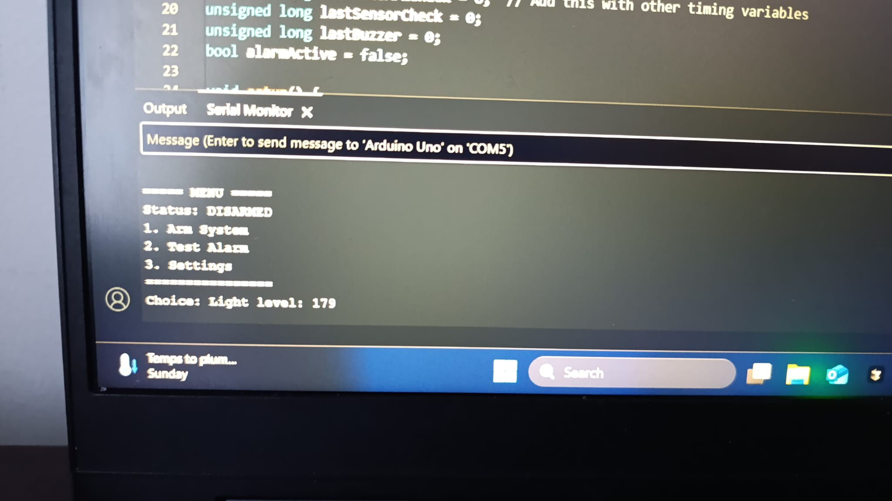
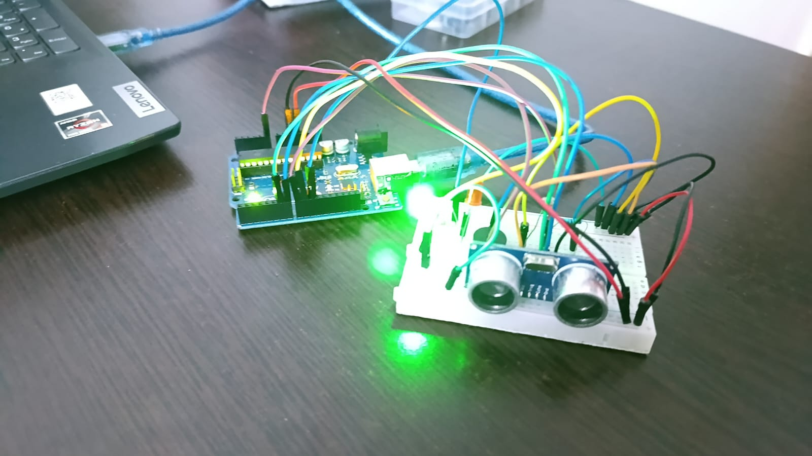
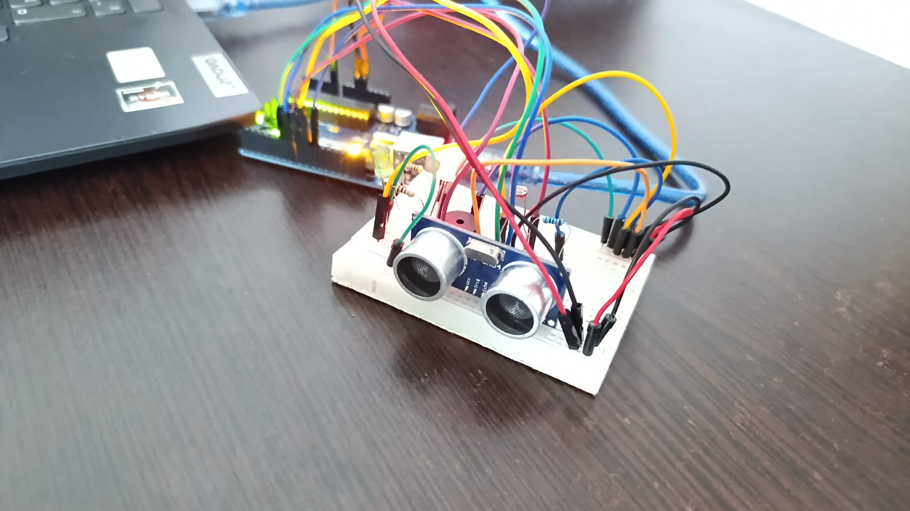

# Homework 3 - Home Alarm System

## Description
This is an alarm system that detects movement using an ultrasonic sensor and can automatically arm itself when it gets dark. You can control it through Serial Monitor with a password and change settings.

## Components
- Arduino UNO
- Ultrasonic sensor HC-SR04
- Photoresistor (LDR)
- Active buzzer
- 1 red LED
- 1 green LED
- Resistors (1kΩ for LEDs, 10kΩ for LDR)
- Breadboard and wires

## How to wire it

**Ultrasonic sensor:**
- VCC → 5V
- GND → GND
- TRIG → Pin 6
- ECHO → Pin 7

**LDR:**
- One leg → 5V
- Other leg → Pin A0 and 10kΩ resistor to GND

**Buzzer:**
- Positive → Pin 8
- Negative → GND

**LEDs:**
- Red LED: Pin 9 (with 1kΩ resistor to GND)
- Green LED: Pin 10 (with 1kΩ resistor to GND)

## How it works

The system has a menu in Serial Monitor where you can arm/disarm the alarm and change settings.

**When disarmed (green LED on):**
- Type 1 to arm the system
- Type 2 to test the alarm
- Type 3 for settings

**When armed (red LED on):**
- Ultrasonic sensor watches for movement
- If something moves close, alarm triggers (buzzer + red LED)
- Type password to stop alarm and disarm

**Auto-arm feature:**
- If room gets dark (LDR detects low light), system arms automatically
- This is like "night mode" in real alarm systems

**Settings menu:**
- Change sensitivity (how much movement triggers alarm)
- Change light threshold (when to auto-arm)
- Change password
- Change system name

## How calibration works

When you start the Arduino, it takes 10 readings from the ultrasonic sensor and averages them. This becomes the "baseline" distance. Then the system watches for changes from this baseline.

For best results, point the sensor at open space during startup and don't move anything for 2 seconds.

## Problems I had

The ultrasonic sensor was tricky at first because I didn't understand how to detect movement vs just distance. I figured out I needed to use the baseline and detect CHANGES instead of fixed distances.

Also had issues with the alarm triggering repeatedly. Fixed it by adding a check to stop monitoring once alarm is active.

The LDR auto-arm feature kept triggering in a loop at first so I had to add timing to only check every few seconds.

## Code notes

Used millis() for timing instead of delay() so the system stays responsive. The menu system waits for Serial input and handles different states (armed vs disarmed).

Password checking is simple string comparison. Settings are stored in variables but reset when Arduino restarts.

## Resources
Built with help from Claude AI for understanding Serial Monitor menus, sensor calibration, and millis() timing. Debugged the movement detection logic and alarm triggering through testing.

## Photo

## Video
https://youtu.be/HRD2i0TbarQ
https://youtu.be/9mTxRMfO8rc

---
**Course:** Introduction to Robotics  
**Date:** November 2024
