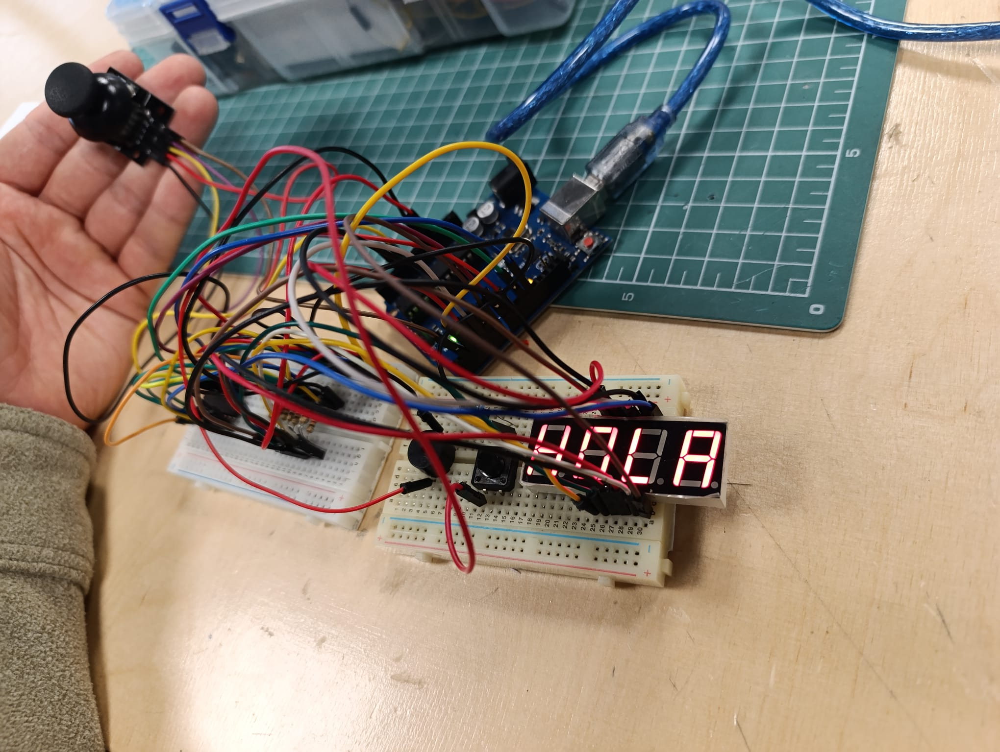
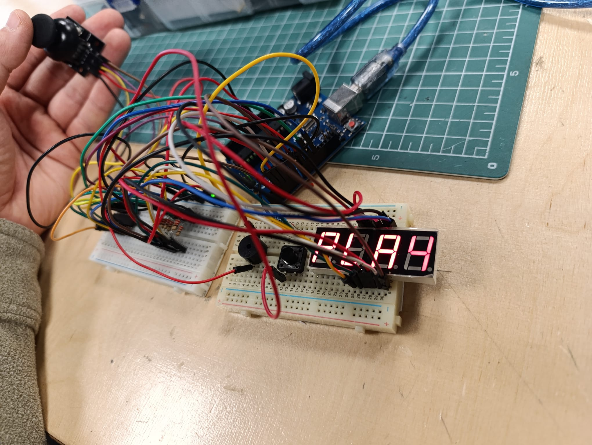
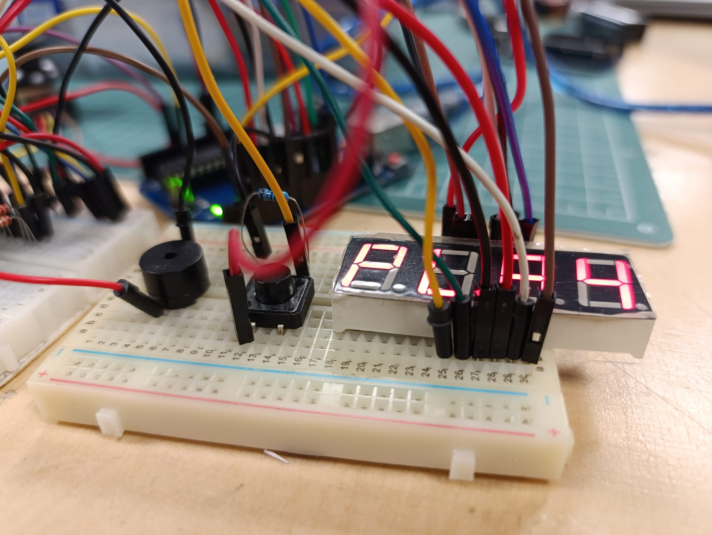
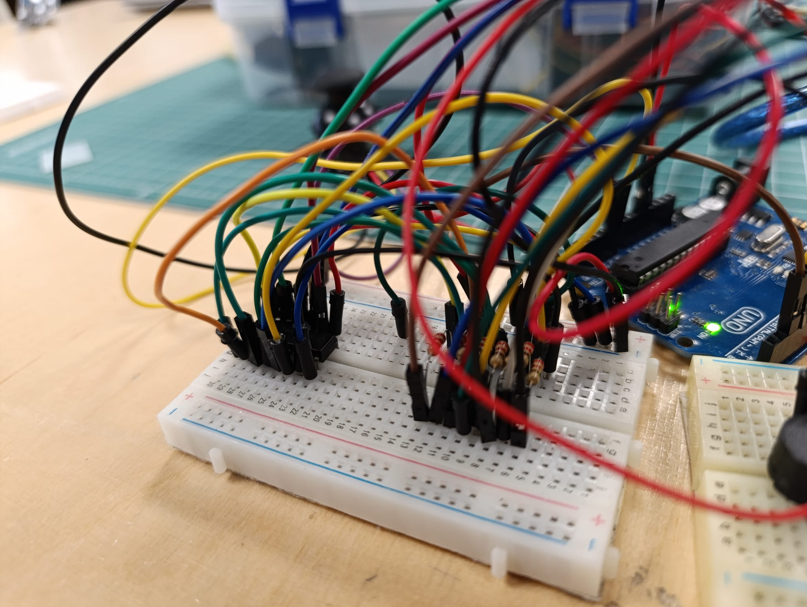
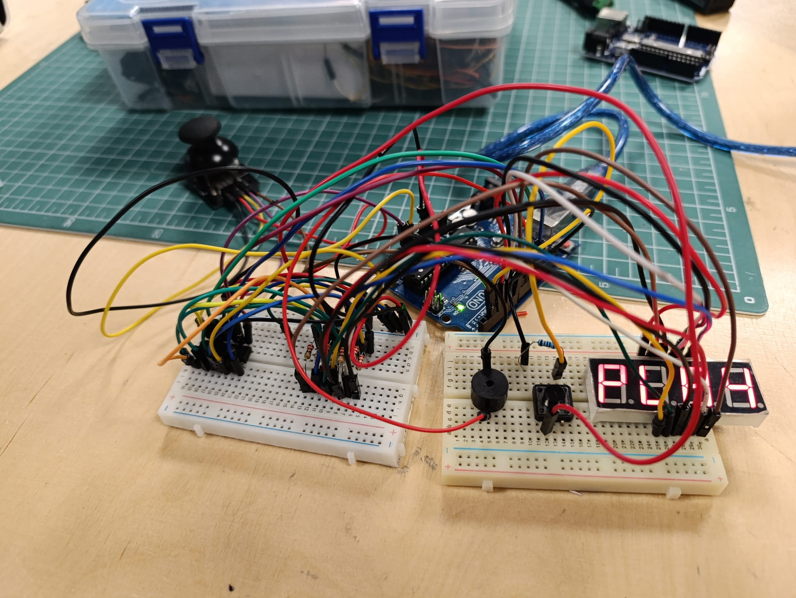

# Homework 4 - Simon Says Game

## Description
Memory game on a 4-digit 7-segment display. The game shows a random sequence of 4 characters and you have to recreate it with a joystick. Gets harder each round!

## Components
- Arduino UNO
- 74HC595 shift register
- 4-digit 7-segment display (SH5461AS - common anode)
- Joystick module
- Buzzer
- Push button (pause)
- 8x 220Ω resistors
- 1x 10kΩ resistor
- Wires and breadboard

## Wiring

### 74HC595
```
Data → Pin 11
Latch → Pin 12
Clock → Pin 8
OE → GND
SRCLR → 5V
VCC → 5V
GND → GND
```

### 74HC595 to Display (through 220Ω resistors)
```
Q0-Q7 → segments a, b, c, d, e, f, g, dp
```

### Display Digits
```
Digit 1 → Pin 4
Digit 2 → Pin 5
Digit 3 → Pin 6
Digit 4 → Pin 7
```

### Joystick
```
VRx → A0
VRy → A1
SW → Pin 2
```

### Other
```
Buzzer → Pin 9
Pause button → Pin 3
```

## How to Play

**Menu:**
- Move joystick left/right to select Play or Score
- Press button to start

**Game:**
1. Memorize the 4 characters shown (5 seconds)
2. Display goes blank
3. Use joystick to input:
   - LEFT/RIGHT: move cursor
   - SHORT PRESS: lock digit
   - UP/DOWN: change character (when locked)
   - LONG PRESS: submit answer
4. Correct → next round (faster!)
5. Wrong → game over

Characters used: 0-9, A-F, and some letters (26 total)

## How it works

Uses a 74HC595 to control the segments with only 3 pins instead of 8. The 4 digits are multiplexed - they switch very fast so it looks like all are on at the same time.

The code uses millis() for timing so nothing blocks. State machine handles menu, showing sequence, player input, and checking answers.

Common anode display means digits turn on with LOW and segments need inverted patterns.

## Problems I had

Getting the display to show correct numbers was hard. At first it showed "898 inverse 6" instead of "1234" because I had the segment mapping wrong. Had to test each bit one by one to figure out the correct wiring.

The cursor blinking only worked on the first digit at first. Fixed by checking which digit is active during the multiplexing.

Joystick kept triggering menu changes when held in one direction. Added edge detection so it only changes once per movement.

## Photos






## Video
[Youtube Video](https://youtube.com/source/2MjrvnNt9W0/shorts?si=VL24Kv8dDquMEyeP)

## Resources
Used Claude AI to understand how 74HC595 works, multiplexing, and non-blocking code with millis(). Also helped debug the segment mapping issue.

---
**Date:** December 2024
