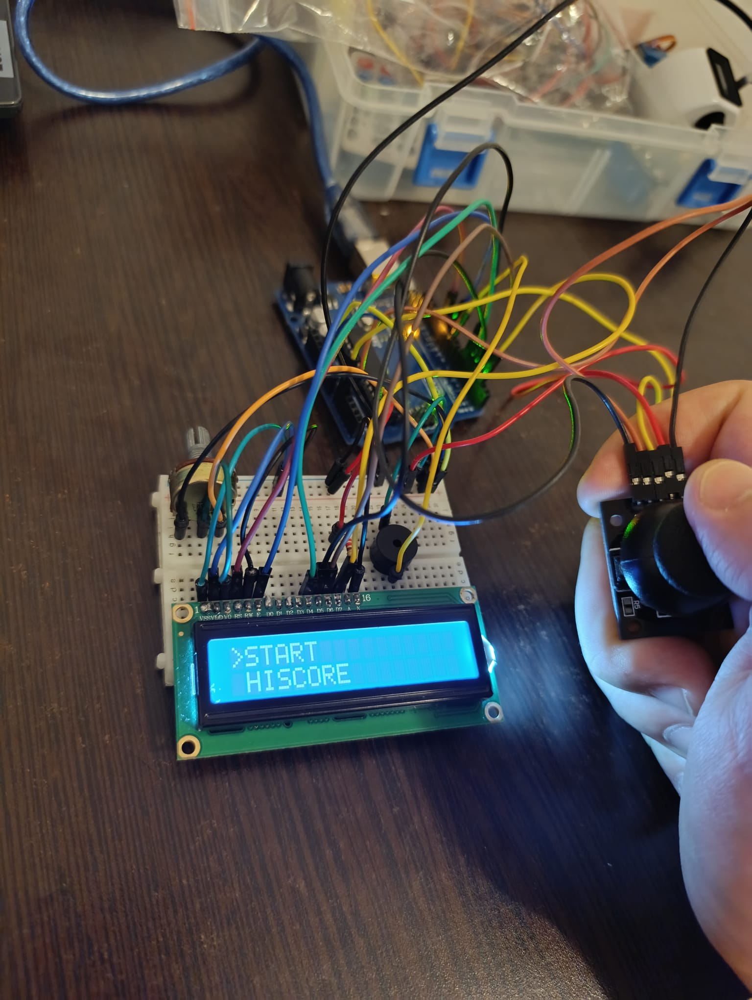
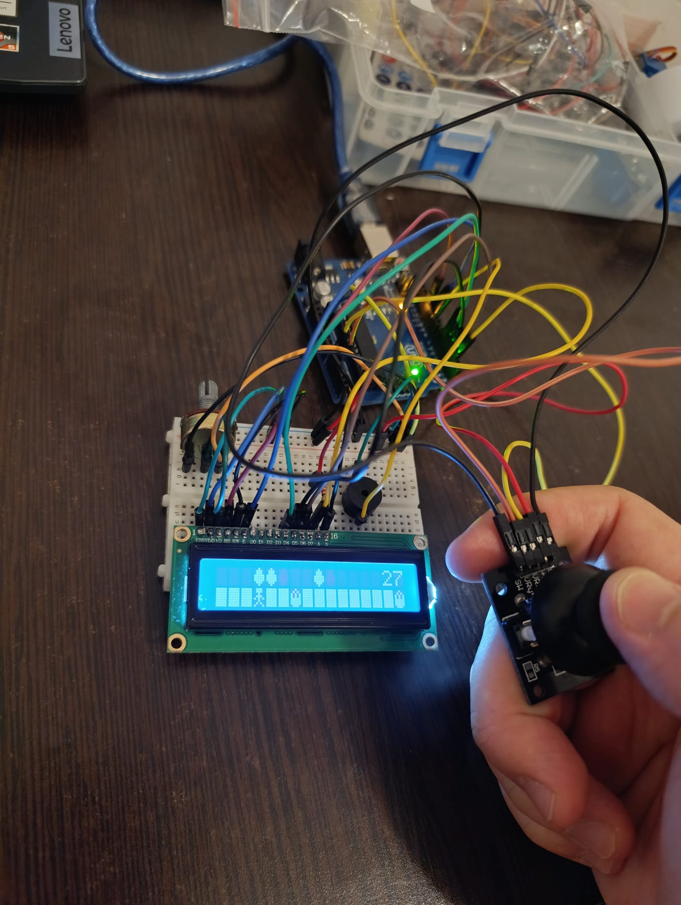
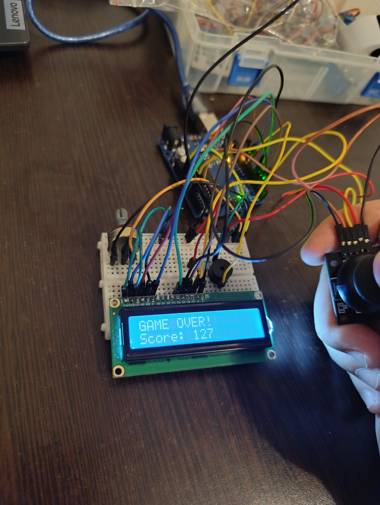
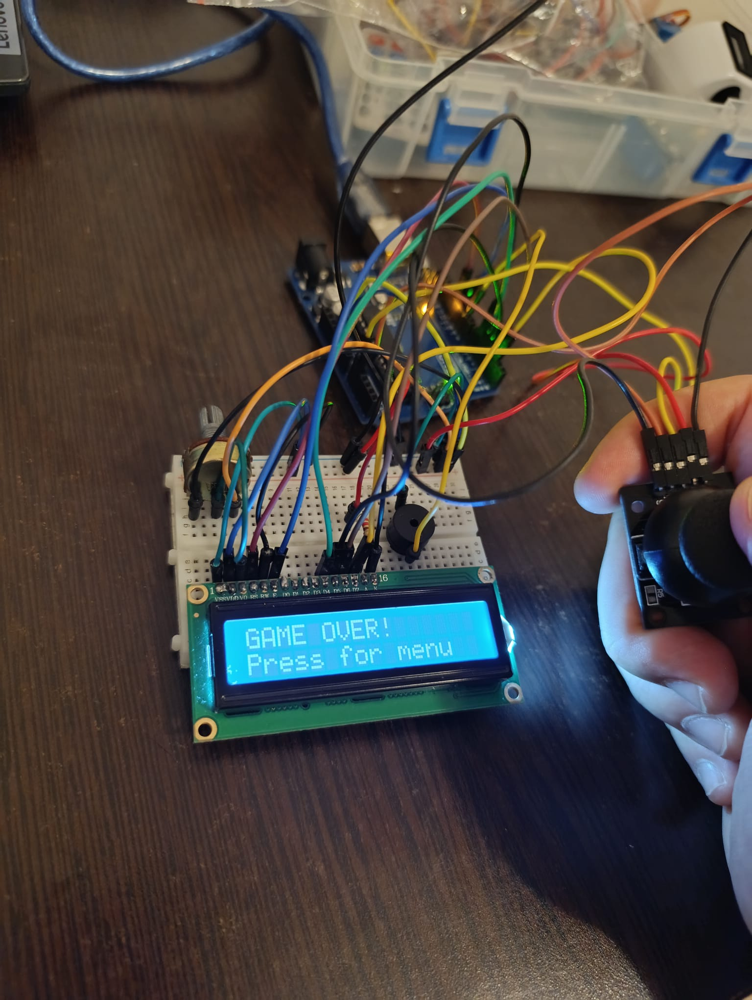
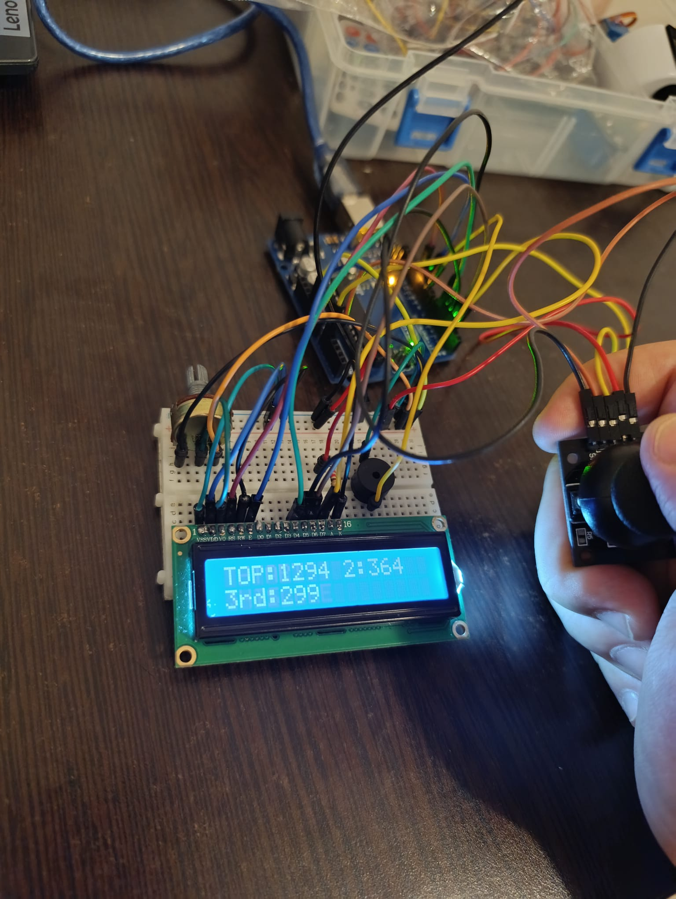

# Homework 5 - Endless Runner Game

## What I Made
An endless runner game on a 16x2 LCD screen. You control a character that automatically runs forward and you have to jump over fire obstacles while collecting cups for bonus points. The game gets faster as you play and saves your high scores!

## Parts I Used
- Arduino UNO
- 16x2 LCD display (HD44780)
- Joystick module
- Active buzzer
- 8x 220Ω resistors (for LCD)
- 10kΩ potentiometer (for LCD contrast)
- Breadboard and jumper wires

## Wiring

### LCD to Arduino
```
RS  → Pin 12
E   → Pin 11
D4  → Pin 5
D5  → Pin 4
D6  → Pin 3
D7  → Pin 2
VSS → GND
VDD → 5V
V0  → Potentiometer (for contrast)
A   → 5V (through 220Ω resistor)
K   → GND
```

### Joystick
```
VCC → 5V
GND → GND
VRy → A0 (Y-axis for jumping)
SW  → Pin 6 (button)
```

### Buzzer
```
+ → Pin 9
- → GND
```

## How to Play

**In the Menu:**
- Move joystick UP or DOWN to choose between START and HISCORE
- Press the joystick button to select

**During the Game:**
- Push joystick UP to jump
- Avoid fire obstacles (they look like spiky things)
- Collect cups (diamond shapes) for +10 points each
- Try to survive as long as possible!

**Scoring:**
Your final score = time you survived (in tenths of seconds) + cups collected × 10

For example: If you survived 50 seconds and collected 5 cups, your score is 500 + 50 = 550 points.

## Game Features

**Menu System:**
- START: Begin a new game
- HISCORE: View the top 3 scores

**Gameplay:**
- Character runs automatically from right to left
- Jump lasts for 3 game frames
- Obstacles appear randomly
- Game speed increases at score 100 and 200
- Your current score shows on the top right

**High Scores:**
The top 3 scores are saved permanently in Arduino's EEPROM, so they stay even when you unplug the Arduino!

## How It Works

I used Option C (Endless Runner) from the homework requirements. The game uses:

**Custom Characters:** I created 4 custom 8x8 pixel characters for the player, cups, fire, and ground blocks.

**World Generation:** The game creates obstacles randomly as you play. I made sure fires are never too close together so you can always jump over them if you react fast enough.

**Non-blocking Code:** Everything uses `millis()` instead of `delay()` so the screen updates smoothly and the game doesn't freeze.

**World Recycling:** The game world is stored in a 200-position array. When you get near the end, it shifts everything back to the beginning so the game never runs out of space.

## Problems I Had to Solve

**Problem 1: Game Freezing**
After playing for a while, the game would freeze completely. I figured out this was because the world array was running out of space. I fixed it by creating a `shiftWorldLeft()` function that moves all the obstacles back when needed.

**Problem 2: Impossible Obstacles**
Sometimes two fires would appear too close together (one on top, one on bottom) and it was impossible to get past them. I fixed this by tracking where all the fires are and making sure new fires are at least 3 positions away from any existing fire.

**Problem 3: Score Not Saving**
At first the high scores would reset every time I unplugged the Arduino. I learned how to use EEPROM to save the scores permanently. Each score takes 2 bytes of memory.

## What I Learned

This was the hardest homework so far! I learned a lot about:
- How to use LCD displays and create custom characters (CGRAM)
- Making games that generate levels randomly (procedural generation)
- Saving data permanently with EEPROM
- Using `millis()` for game timing without freezing
- Debugging array problems and memory issues
- Making sure game obstacles are always beatable

I got help from Claude AI to understand:
- How EEPROM read/write works (big-endian byte storage)
- The best way to check obstacle spacing
- How to prevent the world array from overflowing
- LCD character creation and rendering

## Photos






## Video
[Gameplay Video](https://youtube.com/shorts/b2pRJo6VB6w?feature=share)

---
**Course:** Introduction to Robotics  
**Date:** December 2024  
**Game Option:** Option C - Endless Runner
